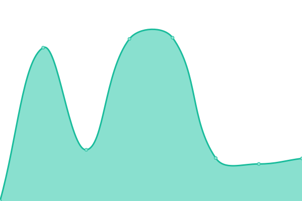

<!--live status--> **🟧 Partial outage**

<!--start: status pages-->
<!-- This summary is generated by Upptime (https://github.com/upptime/upptime) -->
<!-- Do not edit this manually, your changes will be overwritten -->
<!-- prettier-ignore -->
| URL | Status | History | Response Time | Uptime |
| --- | ------ | ------- | ------------- | ------ |
|  [Etriphany](http://www.etriphany.com) | 🟩 Up | [etriphany.yml](https://github.com/etriphany/uptime-monitor/commits/HEAD/history/etriphany.yml) | 

 555ms
     
 | 

<a href="https://etriphany.github.io/uptime-monitor/history/etriphany">7.38%</a>
    

|  [GreenKeeper API](https://green-keeper-vercel.vercel.app) | 🟥 Down | [green-keeper-api.yml](https://github.com/etriphany/uptime-monitor/commits/HEAD/history/green-keeper-api.yml) | 

 495ms
     
 | 

<a href="https://etriphany.github.io/uptime-monitor/history/green-keeper-api">0.00%</a>
    

<!--end: status pages-->

[**Visit our status website →**](https://etriphany.github.io/uptime-monitor)

## About

- Monitors not using templates/updates from [Upptime](https://github.com/upptime/upptime)
